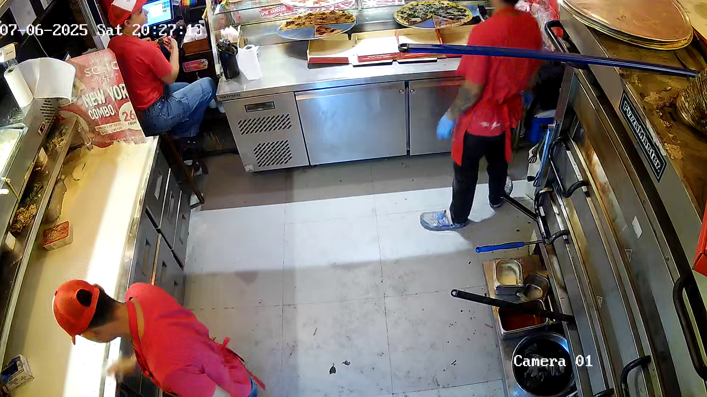
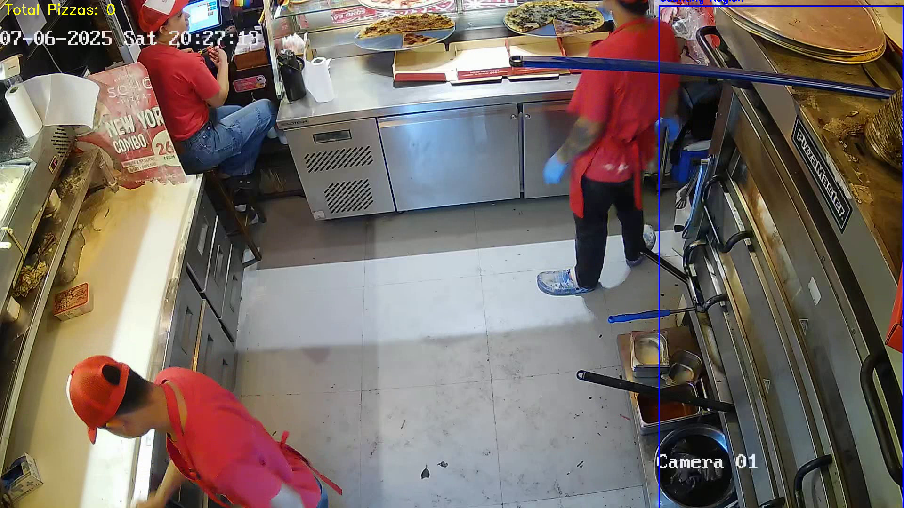

# Pizza Counter

Count pizzas in videos using YOLO detection and CentroidTracker object tracking with a zonning logic.

## Quick Start

1. **Setup**: Place your video in the `input/` folder
2. **Run**: Execute `run.bat process` (Windows) or `./run.sh process` (Linux/macOS)
3. **Results**: Check the `output/` folder for results and annotated video

## Helper Commands

```bash
# Windows
run.bat setup     # Create directories
run.bat build     # Build Docker image  
run.bat process   # Process videos in input/
run.bat zone      # Set up counting zones
run.bat clean     # Clean output files

# Linux/macOS
./run.sh setup    # Create directories
./run.sh build    # Build Docker image
./run.sh process  # Process videos in input/
./run.sh batch    # Process all videos in input/
./run.sh zone     # Set up counting zones
./run.sh clean    # Clean output files

# Direct Docker usage
docker-compose run --rm pizza-counter python app.py --video /app/input/video.mp4 --save-video --confidence 0.35
```

## Configuration

- **Confidence Threshold**: Set in `config.yaml` (default: 0.35) or override with `--confidence`
- **Counting Zones**: Define regions using `zone_setup.py` or load from `zones_config.json`
- **Tracker Settings**: Adjust `max_disappeared` and `max_distance` in `config.yaml`
- **Track Length**: Minimum frames before counting (default: 5)

## Visual Zoning Guide

Setting up proper counting zones is crucial for accurate pizza counting, especially in baking areas where pizzas enter and exit the counting region. Use the interactive zone setup tool (`run.bat zone` on Windows or `./run.sh zone` on Linux/macOS) where you can **drag and drop to draw polygon zones** directly on your video frame - simply click and drag to create zone boundaries, then right-click to complete the zone. Here's a visual comparison:

### Without Baking Area Zoning 


### With Baking Area Zoning


**Solution**: A well-defined zone around the baking area ensures pizzas are counted only once when they enter or exit the designated region, providing accurate counts.

### Zone Setup Tips

1. **Run Zone Setup**: Use `run.bat zone` (Windows) or `./run.sh zone` (Linux/macOS) to interactively define your counting zones
2. **Baking Area Focus**: Draw zones around specific areas where you want to count pizzas (e.g., oven entrance, conveyor belt section)
3. **Avoid Overlaps**: Ensure zones don't overlap with areas where pizzas might linger or move back and forth
4. **Test and Adjust**: Process a sample video and review the results to fine-tune your zones

### Zone Configuration

Zones are saved in `zones_config.json` and can be reused across multiple videos. The format includes:
- **Polygon points**: Define the zone boundaries
- **Zone name**: For identification in results
- **Count direction**: Optional directional counting (in/out)

## Command Line Arguments

```bash
python app.py [OPTIONS]

Required:
  --video, -v          Path to input video file

Optional:
  --model, -m          YOLO model path (default: model_data/weights/best.pt)
  --config             Custom config.yaml path
  --save-video         Save annotated output video (auto-generates filename)
  --confidence, -c     Detection confidence threshold (overrides config)
```

## Output Files

- **Annotated Video**: `{video_name}_processed_{timestamp}.mp4` (if --save-video used)
- **JSON Results**: `pizza_count_results_{timestamp}.json` with detailed statistics
- **Logs**: `pizza_counter.log` with GMT+7 timezone

## Configuration File (config.yaml)

```yaml
MODEL_CONFIG:
  confidence_threshold: 0.5

TRACKING_CONFIG:
  max_disappeared: 30
  max_distance: 50

COUNTING_CONFIG:
  min_track_length: 5
  default_region: [0.25, 0.25, 0.75, 0.75]
```

## Project Structure

```
counter_app/
├── app.py              # Main application (simplified, no --output arg)
├── centroid_tracker.py # Simple centroid-based tracker
├── config.py           # Configuration management
├── config.yaml         # User configuration
├── zone_setup.py       # Interactive zone setup utility
├── run.bat             # Windows helper script
├── run.sh              # Linux/macOS helper script
├── Dockerfile          # Container configuration
├── docker-compose.yml  # Docker services
├── input/              # Place videos here
├── output/             # Results and logs
└── model_data/         # YOLO model weights
    └── weights/
        └── best.pt     # Custom trained model
```

## Features

- **Auto-detects YOLO version** from weight files (YOLOv8, YOLOv11, etc.)
- **CentroidTracker** for reliable object tracking without deep learning overhead
- **Configurable counting regions** or line-crossing detection
- **One-time counting per object** to prevent duplicate counts
- **GMT+7 timezone logging** for consistent timestamps
- **Auto-generated output paths** - no need to specify --output
- **Docker containerized** for cross-platform compatibility

## Troubleshooting

- **No detections**: Lower confidence threshold in config.yaml or use `--confidence 0.2`
- **Too many false positives**: Increase confidence threshold to 0.5-0.6
- **Missing objects**: Adjust tracker `max_distance` parameter
- **Docker issues**: Run `run.bat build` (Windows) or `./run.sh build` (Linux/macOS) to rebuild container
- **Performance**: Use smaller videos or adjust frame processing

## Model Requirements

- YOLO format weights (`.pt` files)
- Trained for pizza detection (class 0 should be "pizza")
- Compatible with ultralytics YOLO (YOLOv8, YOLOv11, etc.)

## Limitation - Future update 
- Update to a model with better accuracy
- Connect system to a live camera